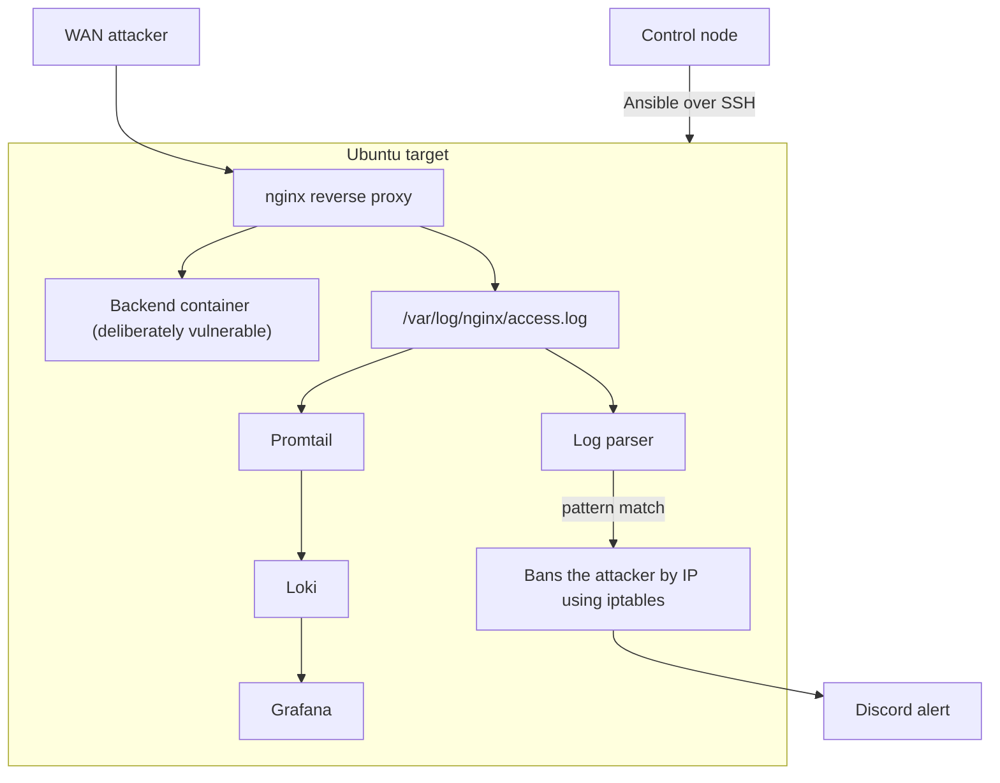

# SOC Defender Lab

A web server with built-in intrusion detection and response. It watches nginx logs for malicious HTTP requests, automatically bans the attacker's IP with iptables, sends alerts to Discord, and forwards logs to Grafana.
The stack consists of an nginx reverse proxy, Docker, and Promtail/Loki, deployed to a fresh Ubuntu host with a single Ansible command.



## Prerequisites

1. A target with Ubuntu/Debian installed (Tested on Ubuntu LTS 24.04) and set up with a sudo capable user, needs outbound internet
2. Software installed on your control node: python 3, ansible, git
3. A Discord server with webhook permission

## Setup

1. Set up the ssh to your target with a key login: [guide](https://phoenixnap.com/kb/ssh-with-key)
2. Create a discord server and generate a webhook: [guide](https://www.geeksforgeeks.org/websites-apps/how-to-make-a-webhook-in-discord/)
3. Clone the repository: `git clone https://github.com/ape322/soc-defender-lab`
4. Go to the ansible folder: `cd soc-defender-lab/ansible`
5. Create a file with your vault password using: `echo '<your password>' > ~/.vault_pass`

   > [!NOTE]
   > Your password will be visible in your shell history.

6. Change the access to the vault password: `chmod 600 ~/.vault_pass`
7. Create an ansible vault with a Discord webhook using a command: `ansible-vault create secrets.yml` _(this opens a text editor)_
8. Insert your webhook into the file and save it as: `discord_webhook: "<insert your discord webhook>"`
9. Edit and save the inventory.ini: replace the ip with your target ip; and change the user as: `ansible_user=<insert your username of the target>`

## Deploy

Deploy the infrastructure from the ansible folder using a command: `ansible-playbook site.yml -K`

   > [!NOTE]
   > -K prompts for the target's sudo password - provide it

## Verify

   > [!WARNING]
   > Testing from the control node will ban its IP and lock you out.

1. To verify if everything is up and running use the following command: `curl 'http://<your target ip>/wp-admin'`
2. You should receive a notification to your Discord server (If tested from the control node - now you can't reach the target)
3. To unban yourself:
    1. Log in to the target - through the console if you're locked out, or over SSH if you tested from another machine
    2. Run the following commands:
    ```bash
    sudo iptables -D INPUT -s <tester-ip> -j DROP
    echo '[]' | sudo tee /var/log/soc_threat_ledger.json
    sudo docker restart active-sentry
    ```

## Design decisions

### `NET_ADMIN` and privileged mode

Log parser is using iptables to ban attackers, that suggests running it in privileged mode. If it runs privileged - the container runs without isolation, so if it's compromised, the attacker effectively has root on the VM. The decision was to give it `NET_ADMIN` capability, that's all that container needs to change the firewall rules.

### Deleting `docker compose down`

This command was unnecessarily stopping everything on each deploy, even when nothing was changed. For a security tool this means the parser stops monitoring logs during every deploy. The `docker compose up -d` already compares running containers and recreates only what was changed.

### `shell=True` and argument list in the parser

Previously the ban function in the tool used to run in the shell with `shell=True` argument, which added another attack surface. The whole command strings were going to a `shell`, which interprets characters like `;` and `|` as instructions. The IPs were coming from a log file, which could contain values like: `1.2.3.4; rm -rf /` and it would run the second command. It was replaced with argument list, so the attacker couldn't inject a command. As a second layer of protection - every IP from the log file is getting checked by `is_valid_ip()`​ function before it reaches iptables.

### Binding to 127.0.0.1:8080

The backend used to be published as `8080:8080`, which exposed it on every network interface. A request that goes straight to `8080` never passes through nginx, so nothing was logged and the log parser doesn't see it. Binding to `127.0.0.1:8080` makes `8080` reachable only from the VM, nginx is the only way in.

### Loud failure if WEBHOOK is missing.

The log parser checks for `DISCORD_WEBHOOK` at startup and exits if it's missing. It is better for a tool to fail exit immediately than believing that you'd be notified and you wouldn't. One trade off: exiting also stops banning, not just the alerts.

   > [!NOTE]
   > nginx logs the real connection IP, so this likely wasn't exploitable in practice. But the pattern was unsafe, because log data is untrusted input.

### The ledger task fix

The task used to write `[]` on each deploy wiping all persitent bans. It got fixed with `force: false`, so if the ledger is already there - it won't be overwritten by another deploy. 

### Restoring bans at startup

The parser was loading the ledger but never reapplying or checking if the rule in the `iptables` exists. Fixed by checking `iptables` rules after each start, so they won't duplicate (unban command only deletes 1 copy of the rule) and reapplying them if needed. 

  > [!NOTE]
  > If the restore of bans fails, the tool will exit immediately and let you know which ip ban wasn't reapplied. Same kind of trade off as in webhook failure. 
